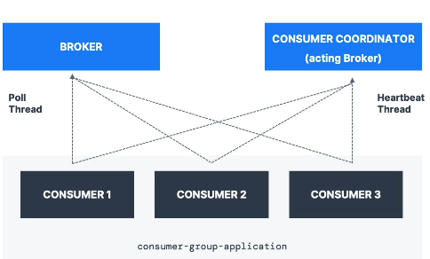
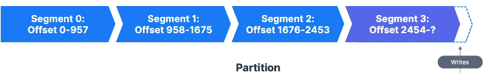

# KAFKA Notes (Code Help https://github.com/conduktor/kafka-beginners-course)

kafka topic:

1. It's a particular streams of data , eg : logs, tweets purchases, gps_data
2. List like a table in a database (without any constraints).
3. you can have as many topic as you want.
4. A topic is identified by its name.
5. Support any kind of format eg json, xml....
6. sequence of message is called a DataStream.
7. you cant query topic, instead use the kafka producer to send the data and kafka consumer to read the data

Partition and Offsets:

1. Topics are split in partition (ex: 100 partition)
    1. each message will be ordered in partition.
    2. Each message within a partition get an increment id , called offset.
2. kafka topics are immutable, once the data is written into the partition, it cant be changed.
3. Data in kafka is kept for only for a limited time(default is 7 days - configurable).
4. offset only have a meaning for a specific partition.
   eg: offset 3 in a partition 0 doesn't represent the same data as offset 3 of portion 1.
5. offset are not re-used even if previous mgs is deleted .
6. Order is granted only within a partition (not across the partition).
7. Data is assigned randomly to a partition unless a key is provided.
8. you can have as many partition as you want.

Producers:

1. Producers write data toa topics (which ate made fo partitions).
2. Producers know to which partition to write to (and which kafka broker has it).
3. In case of kafka broker failure, producers will automatically recover.

**Producers: Message keys**

1. Producers can choose to send a key with the message (String, number binary etc.)
2. if key = null, data is sent round-robin (partition 0, 1, 2...)
3. if key != null, the all the message for that key will go in the same partition ( hashing )
4. A key are typically sent if you need message ordering for a specific field (e.g truck id)

**Kafka Message Serializer**

1. kafka only accept bytes as na inout from the producer and send bytes out as output to consumer.
2. Message Serialization means transforming object/data into bytes.
3. They are used on the value on the key.
4. Common Serializers
    1. String (json)
    2. int, float
    3. avro
    4. protobuff

**Kafka Message hashing**

1. A kafka partitioner is a code logic that takes a record and determine to which partition to send it into.
2. Key hashing: is the process of determining the mapping of a key to a partition.
3. In the default kafka partitioner, the key are hashed using the murmur2 algo with the formula.
   <b><i>formula: targetPartition = Math.abs(Utils.murmur2(keyBytes)) % (numPartitions - 1)</i></b>

**Consumer**

1. Consumers read data from a topic (identified by name) - pull model.
2. consumers automatically know which broker to read from.
3. In case of broker failure, consumer know how to cover.
4. Data is read in order from low to high offset within each partition.

**Consumer Deserializer**

1. Deserialize indicates how to transform byes into object / data
2. They are used on the value and the key of the message
3. Common Deserializer
    1. String (incl. JSON)
    2. Int, Float
    3. Avro
    4. ProtoBuf
4. The Serialization / deserialization type must not change a top lifecycle (create a new topic instead)

**Consumers Group**

1. ALl the consumers in an application read data as a consumer groups.
2. Each consumer's within a group reads from exclusive partition.

**Consumers Group**

1. if you have more consumers than partitions, some consumers will be inactive.
2. Multiple consumer on one topic
    1. it is acceptable to have multiple consumer groups on the same topic.
    2. To create a distinct group, use the consumer property _group.id_.

**Consumer offset**

1. Kafka stores the offsets at which a consumer group has been reading.
2. The offsets committed are in kafka _topic_ named ___consumer_offsets_
3. When a consumer in a group has processed data received from a kafka , it should be periodically committing the
   offset (the kafka broker will write to ___consumer_offsets_ , not the group itself)

**Deliver semantic for consumers**

1. By default, Java Consumers will automatically commit offsets (at least once).
2. There are 3 delivery semantics if you choose to commit manually.
3. At least once (usually preferred)
    1. Offsets are committed after the message is processed.
    2. If the processing goes wrong, the message will be read again.
    3. This can result in duplicate procesing of message , Make sure your preprocessing is idempotent (i.e processing
       again the message won't impact your systems).
4. At most ones.
    1. Offsets are committed as soon as messages are received.
    2. if the processing goes wrong, some message will be lost (they won't be read again).
5. Exactly ones.
    1. For kafka => kafka workflows: use the Transactional API (easy with Kafka Streams API)
    2. for kafka => External System workflows: use an idempotent consumers.

**Kafka Brokers**

1. A kafka cluster is composed of multiple brokers (servers).
2. Each brokers are identified with its id (Integers)
3. Each brokers contains certain topic partitions.
4. After connection to any broker(called a bootstrap broker), you will be connected to the entire cluster(kafka client
   have smart mechanics for that).
5. A good number to get started is 3 brokers , but some big clusters have over 100 brokers.

**Brokers and topics**

1. Example of Topic-A with 2 partitions and Topic-B with 2 partitions
2. Note: data is distributed, and Broker 103 don't have any Topic B data.

**Kafka Broker Discovery**

1. Each kafka broker is called "bootstrap server".
2. That means that _you only need to connect to one broker, and the kafka client will know how to be connected to the
   entire cluster (smart client).
3. Each broker know about all brokers, topics and partitions (metadata).

**Topic replication factor**

1. Topic should have a replication factor >1 (usually between 2 and 3 ).
2. This way if a broker is down, another broker can serve the data.
3. Ex : Topic - A with partition and replication factor of 2.

**Concept of Leader for a partition**

1. At any time only ONe broker can be leader of a given partition.
2. Producer can only send data to the broker that is the leader of partition.
3. The other brokers will replicate the data.
4. Therefore, each partition has one leader and multiple (ISR-In sync replication).

**Default producers and Consumers behaviour with leaders.**

1. kafka Producers can only write to the leader broker for a partition.
2. kafka Consumer by default read from the leader broker for a partition.

**Kafka Consumer replica Fetching**

1. Since kafka 2.4, it is possible to configure consumer to read from the closet replica.
2. This mey help improve latency, and also decrease network costs if using the cloud.

**Producer Acknowledgement**

1. Producers can choose to receive acknowledgement of data writes :
    1. ack=0: Producer won't wait for acknowledgement (possible data loss).
    2. ack=2: Producer will wait for leader acknowledge (limited data loss).
    3. ack=all: Leader + replica acknowledgement (no data loss).

**Zookeeper**

1. Zookeeper manages kafka brokers (keeps a list of them).
2. Zookeeper helps in performing leader election for partition.
3. Zookeeper sends notification to kafka case of changes
   (new topic, broker dies, broker come up, deletion topics, etc...)
4. kafka 2.x cant work without zookeeper,
5. kafka 3.x can work without zookeeper (KIP-500) - using kafka Raft instead.
6. kafka 4.x will not have Zookeeper.
7. Zookeeper design to operate with an odd number of services (1,3,5,7)
8. Zookeeper has a leader (writes) the rest of the servers are followers (read)

**Should you use ZooKeeper**

1. with kafka broker.
    1. Yes, until kafka 4.0 id out while waiting without zookeeper to to be production ready.
2. with kafka client.
    1. Over time, the kafka client and CLi have been migrated to leverage the broker as a connection endpoint instead of
       zoopeeker.
    2. Since kafka 0.10 , consumer store offsets in kafka and Zookeeper and must not connect to zookeepr as it is
       deprecated.
    3. Since kafka 2.2 , the kafka-topics.sh CLI command reference kafka broker and not Zookeeper for topic management (
       creating, deleting etc) and the zookeeper CLI argument is deprecated.
    4. All the APIs and commands that were previously leavings Zookeeper ate migrated to use kafka instead , so that
       when cluster are migrated to be without Zookeeper , the change is invisible to client.
    5. Zookeeper is also less secure than kafka, and there Zookeeper ports should only be opened to all the traffic from
       kafka broker, and not from kafka clients.
    6. Therefore, never use Zookeeper as a configuration in your client, and other programs that connect to kafka.

**Kafka KRaft**

1. Zookeeper have scaling issues when kafka cluster have > 100,000 partitions
2. By removing Zookeeper, Apache kafka can
    1. Scale to millions of partitions, and became easier to maintain and set-up.
    2. Improve stability , make to monitor, support and administer.
    3. Single security model form teh whole system.
    4. Single process to start with kafka
    5. Faster Controller shutdown and recovery time.

<b><u>Installing kafka</u></b>: https://www.conduktor.io/kafka/starting-kafka
<b><u>Installing kafka</u></b>: https://www.conduktor.io/kafka/how-to-install-apache-kafka-on-windows

**Kafka CLI : kafka-console-consumer.sh**

1. Consumer from tail of topic.
2. Consumer from the tail of the topic.
3. Show both key and value in the output.

**Consumer Group and Partition Rebalanced**

1. Move partition between the consumers is called a re-balance.
2. Reassignment of partitions happens when a consumer group leave or join a group.
3. it also happens if an administrator adds new partition into a topic.

* if a new partition is added or remove how re-balancing happens

    1. **Eager Re-balancing**
        * All consumer stops, and they give up there partition-ship.
        * They all rejoin the consumer group and get the new partition assignment.
        * During the Entire shot period of time , the entire consumer groups stops working.
        * Consumer don't necessarily "get back " the same partitions as they used to.
          

    2. Cooperative Re-balance (Incremental Re-balance)
    * Re-assigning small subset of the partition from one consumer to another.
    * Other consumer that don't have a reassigned partition can still process uninterrupted.
    * it can go through several stable iterative to find a "stable" assignment (hence "incremental").
    * Avoids the "stop-the-world" events where all consumers stop processing data.
      

**How to use (Cooperative Re-balance)**

* <i style="color:red">kafka Consumer</i>: partition.assignment.strategy
    * RangeAssignor: assign partitions on a pre-topic basis (can lead to imbalance).
    * RoundRobin: assign partition all topic in round-robin fashion, optimal balance.
    * StickyAssignor: balance like RoundRobin, and then minimises partition movement when consumer join/ leave the group
      in order to minimise movements.
    * CooperativeStickyAssignor: rebalances strategy is identical to StickyAssignor but supports cooperative rebalances
      and therefore consumers can keep on consuming from teh topic.
    * The default assigner is [RangeAssignor, CooperativeStickyAssignor]: which will use the RangeAssignor by default,
      but allows upgrading to the Cooperative StickyAssignor with just a single rolling balance that removes the
      RangeAssignor from the list.
* <i style="color:red">kafka Connect</i>: already implemented (enabled by default)
* <i style="color:red">kafka Streams</i>: Turned on by default using StreamsPartitionAssignor.

**Static Group Membership**

1. By default, when a consumer leaves a group, its partitions are invoked as re-assigned.
2. If it joins back, it will have a new "member ID" abd new partitions assigned.
3. If you specify group.instance.ud it make the consumer a **static member**.
4. upon leaving, the consumer has up to session.timeout.ms to join back and get back its partitions (else they will be
   re-assigned), without triggering a re-balance.
5. This is helpfully when consumers maintain local state adn cache(to avoid re-building the cache).

**Kafka Consumer - Auto offset commit Behaviour**

1. In the Java Consumer API, offsets are regularly committed.
2. Enable at-least once reading scenario by default (under condition).
3. Offsets are committed when you call .poll() and auto.commit.interval.ms the elapsed
4. Example: <i>auto.commit.interval.ms=5000</i> and <i>enable.auto.commit=true</i> will commit.
5. <u>Make sure all the messages are successfully processed before calling the poll() again.</u>
    1. if you don't you will not be in at-least-one reading scenario.
    2. In the (rare) case , you must disable enable.auto.commit, and most likely most processing to a seperate thread,
       and then from time-to-time call .commitSync() or .commitAsync() with the correct offsets manually (advanced).

<h2> Advance Java Kafka </h2> : https://www.conduktor.io/kafka/advanced-kafka-consumer-with-java

**Producer Acknowledgement (acks)**

* Producers can choose to receive acknowledgement of data writes:
    1. <u>acks=0</u>: Producer wont wait for acknowledgement (possible data loss)
    2. <u>acks=1</u>: Producer will wait for leader acknowledgement (limited data loss)
    3. <u>acks=all</u> : leader + replicas acknowledgement (no data loss)
  
1. <b>Producer.acks=0</b>
   1. When acks=0 producers consider message as "written successfully" the moment the message was sent without waiting for the broker to accept it at all.
   2. If the broker goes offline or an exception happens , we won't know and will lose data.
   3. Useful for data where it's okay to potentially lose message, such as metrics collection.
   4. Producers the highest throughput setting because the network overhead is minimized.
2. <b>Producer.acks=1</b>
   1. when acks=1, producers consider message as "written successfully" when the message was acknowledged by only the leader.
   2. Leader response is requested, but replication is not guarantee as it happens in the background.
   3. If the leader broker goes offline unexpectedly but replicas haven't replicated the data yet we have a data loss.
   4. If an ack is not received, the producer may retry the request.
3. <b>Producer.acks=all/-1</b>
   1. When ack=all, producers consider message as "written successfully" when the message is accepted by all in-sync replicas (ISR).
   2. Default for kafka 3.x+
   
    

<b>Producer acks=all & min.insync.replicas (these both go hand in hand)</b>
1. The leader replica for a partition checks to see if these are enough in-sync replicas for safety writing the message (controlled by the setting min.insync.relicas)
   1. min.insync.replicas=1: only the broker leader need to successfully ack .
   2. min.insync.replicas=2: only the broker leader and 1 replicas to successfully ack .

<b>Kafka Topic Availability</b>
1. Availability : (considering RF=3)
    1. acks=0 & acks=1 : if one partition is up and considering as ISR, the topic will be available for writes.
    2. ack=all: 
       1. min.in-sync.replicas=1 (default): the topic must have at least 1 partition up as in ISR (that includes the reader) and so we can tolerate two broker being down.
       2. min.in-sync.replicas=2: the topic must have at least 2 ISR up, and therefore we can tolerate at most one broker being down (in the case of replication factor of 3), and we have the guarantee that for every write, the data will be at least written twice.
       3. min.in-sync.replicas=3: this wouldn't make ush since for a corresponding replication factor of 3, and we couldn't tolerate any broker going down.
       4. in summary, when acks=all with a replication.factor=N and min.in-sync.replicas=M we can tolerate N-M brokers going for topic available purposes.

** acks=all and min.insync.replicas=2 is the most popular options for data durability and allows you to withstand at most the loss of **one** kafka broker.

**Producers Retries:** 

1. In case of transient failure, developer are expected to handle exceptions, otherwise the data will be lost.
2. Example of transient failure: 
   1. NOT_ENOUGH_REPLICAS (due to min.in-sync.replicas setting): 
3. There is <z style="color:blue">"reties"</z> 
   1. default to 0 for kafka <= 2.0
   2. default to 2147483647 for kafka >= 2.1
4. The retry.backoff.ms setting is by default 100ms.
 (Old version) 
5. if you are not using as idempotent producer (not recommended - old kafka):
   1. In case of retries, there is a chances that messages will ve sent out of order (if a batch has failed to be sent).
6. For this, you can see the setting while controls how much produce required can be made in parallel : max.in.flight.requests.per.connection.
   1. Default: 5
   2. Set it to 1 if you need to ensure ordering (may impact throughput).

**Producer Timeout**
1. If retries>0, for example retries=2147483647, retries are bounded by a timeout.
2. Since kafka 2.1, you can set : delivery.timeout.ms=120000==2min.

 **Idempotent Producer**
 
1. The Producer can introduce duplicate message in kafka due to network errors.

2. In kafka >=0.11, you can define a "idempotent producer" which won't introduce duplicate on network error.

   3. max.in.flight.request=5 (kafka version>=1.0 higher performance & kafka ordering - kafka5494))
5. These setting are applied automatically after your producer has started  if not manually set.
6. just set : property.set("enable.idempotence", true);
 

**Safe kafka Producers** 

1. acks=all: ensure data is properly replicated before an ack is received.
2. min.insync.replicas=2 (broker/topic level): ensure two brokers in ISR at least have the data after an ack.
3. enable.idempotent=true: Duplicated are not introduces due to network retries.
4. retries=MAX_INT(PRODUCER level): Retry until delivery.timeout.ms is reached.
5. delivery.timeout.ms=120000: failed after retry for 2 minutes
6. max.in.flight.request.per.connection=5: ensure max performance while keeping message ordering.

**Message Compression at the Producer level**

1. Producer usually send data that is text-based, for example with JSON data.
2. In this case, it is important to apply compression to the producer.
3. Compression can be enabled at the Producer level and doesn't require any configuration change in the Brokers or in consumers.
4. compression.type can be none(default), gzip, lz4, snappy, zsed (kafka 2.1)
5. Compression is more effective the bigger the batch of message being sent to kafka.

**Message Compression**
1. The compressed batch has the following advantage:
   1. Much smaller producer request size (compression ration upto 4x).
   2. Faster to transfer data over network.
   3. Better throughput.
   4. Better disk utilization in kafka (stored message on disk are smaller).
2. Disadvantages (very minor)
   1. Producers must commit some CPu cycle to compression.
   2. Consumer must commit som CPu cycle to decompression.
3. Overall:
   1. Consider testing snappy or lz4 for optimal speed / compression ratio (test others too).
   2. Consider tweaking linger.ms and batch.size to have bigger batch, and therefore more compression and higher throughput.
   3. Use compression in production.
4. Broker/topic level:
   1. compression.type=producer(default), the broker takes the compressed batch from the producer client and writes it directly to the topic's log file without recompressing the data.
   2. compression.type=none: all batches are decompressed by the broker
   3. compression.type=lz4 : 
      1. If it's matching the producer setting, data is stored in disk as is.
      2. If it's a different compression setting, batched are decompressed by the broker and then re-compressed using compression algo specified.
* <u>Warning</u>: if you enable broker-side compression, it will consumer extra CPu cycle.

**linger.ms & batch.size (how to improve batching mechanism)**

1. By default, Kafka producers try to send records as soon as possible:
   1. it will have up to max.in.flight.requests.per.connections=5, meaning up to 5 message batches being in flight(being sent between the producer in the broker) at most
   2. After this, if more message must ve sent while others are in fight, Kafka is smart and will start batching them before the next batch send.
2. This is smart batching helps increase throughput while maintaining very low latency.
   1.Added benefit:  batches have higher compression ratio so better efficiency

3. 2 Setting to influence the batching mechanism:
   1. linger.ms :(default 0) how long to wait until send a batch. Added a small number of example 5 ms helps add more message in the hatch at the expense of latency.
   2. batch.size: if a batch is filled before linger.ms, increase the batch size.

 
**Batch size (default)**

1. Max number of bytes that will be included in a batch.
2. Increasing a batch size something like 32kb or 64 kb can help increase the compression, throughput and efficiency of request.
3. Any message that is bigger than the batch size will not be batched.
4. A batch is allowed per partition, so make sure that you don't set it to a number that's too high, otherwise you'll run waste memory.

https://blog.cloudflare.com/squeezing-the-firehose/

**Producer Default Partitioner when key != null**

1. key hashing: is the process of determining the mapping of key of a partitions.
2. in the default partitioner, the key are hashed using the mummur2 algorithm. targetPartitions = Math.abs(Utils.murmur2(keybytes)) % (numberPartitions -1);
3. This means that same key will go to the same partition and adding partitions to a topic will completely alter the formula .
4.it a most likely preferred to not override the behaviour  of the partitions, but it is possible to do so using partitioner.class.

Producer Default partitioner when key=null
1. When key=null, the producer has a default partitioner that varies:
   1. Round RobinL for kafka 2.3 and below
   2. Sticky Partitioner: for Kafka 2.4 and above.
2. Sticky Partitioner improves the performance if the producer especially when high throughput when the key is null.

**Max.block.ms & buffer.memory**
1. if the producer produces faster than the broker can take, the records will be buffered in memory.
2. buffer.memory=32MB : the size of the send buffer
3. That buffer will fill up overtime and empty back down when the throughput to the broker increases.
4. I that buffer is full (32 MB), then the .send() method will start to block (won't return right away).
5. max.block.ms-60000: the time the .send() will block until throwing an exception.
   1. The producer has filled up iy=ts buffer.
   2. The broker is not accepting any new data.
   3. 60 seconds has elapsed.
6. If you hit an exception hit that usually means your broker are down or overloaded as they can't respond to request.

**Consumer Offset Commit Strategy**

1. There are two most common pattern for committing offset in a consumer application.
2. 2 Strategies: 
   1. (easy) enable.auto.commit=true & synchronous processing of batches
   2. (medium) enable.auto.commit=false & manual commit of offsets.
 

**Kafka Consumer - Auto Offset Commit Behavior**
1. In the Java Consumer API, offsets are regularly committed
2. Enable at-least once reading scenario by default (under conditions).
3. Offsets are committed when you call .poll() and auto.commit=true
4. <u><Make sure message are all successfully processed before you call pall() again</u>
   1. If you don't, you will not be in at-least-once reading scenario.
   2. In that (rare) case, you must disable enable.auto.commit and most likely most processing to a separate thread, and then from time-to-time .commitSync() ot .commitASync() with the correct offset manually (advanced).
   

**Consumer Offset Commits Strategies**
1. enable.auto.commit=true & synchronous processing or batch
2. With auto-commit, offset will be committed automatically for you at regular interval (auto.commit.interval.ms=5000 by default) every-time you call .poll()
3. if you don't use synchronous processing, you will be in "at-most-once" behaviour because offsets will be committed before you data is processed.

4. <u>enable.auto.commit=false & synchronous processing of batches</u>
   
5. you control when you commit offset and what's the condition for committing them.
6. Ex: accumulating records into a buffer and then flushing the buffer to a database + committing offsets asynchronously then.
7. <u>enable.auto.commit=false & storing offset externally</u> (advanced)

**Consumer Offset reset Behaviour** 
1. A consumer is Expected to read from a log continuously.
 
2. But if you application has a bug, you consumer can be down.
3. If kafka has a retention of 7 days, and your consumer is down for more than 7 days , the offset are "invalid".
4. The behaviour for the consumer is to then use: 
   1. auto.offset.reset = latest : will read from the end of the log.
   2. auto.offset.reset = earliest : will read from the start of the log.
   3. auto.offset.reset = none :  throw exception if no offset is found.
5. Additionally , consumer offset can be lost
   1. if a consumer hasn't read data in 1 day (kafka<2.0) 
   2. if a consumer hasn't read data in 7 day (kafka>=2.0) 
   
6. This can be controlled by the broker setting offset.retention.minutes.   

**Replaying daya for Consumers**
1. To replay ata for a consumer group.
   1. Take all the consumers from a specific group down.
   2. Use kafka -consumer-group command to set offset to what you want.
2. Bottom Line:
   1. Set proper data retention period & offset retention period.
   2. Ensure the auto offset reset behaviour is the one you expect / want.
   3. Use replay capability in case of unexpected behavior.

**Controlling Consumer Liveliness**

1. Consumer ina group talk to a consumer groups Coordinator.
2. To detect consumers that are "down " there is a "heartbeat" mechanism and a "poll" mechanism.
3. <u>To avoid issues, consumers are encouraged to process data fast and poll often</u>.

**Consumer Heartbeat Thread**

1. heartbeat.internal.ms (default 3 seconds):
   1. How often to send heartbeats.
   2. Usually set to 1/3rd of session.timeout.ms.
2. session.timeout.ms(default 45 sec kafka 3.x+, before 10 sec):
   1. Heartbeats are sent periodically to the broker.
   2. if no heartbeat is sent during that period, the consumer is considered dead.
   3. Set even lower to faster consumer reblances.

**Consumer Poll Thread**

1. max.pol.interval.ms(default):
   1. maximum amount of time between two .poll() can before declaring the consumer dead.
   2. This is relevant for Big Data frameworks like SPark in case the processing takes time.

2. <u> This mechanism is used to detect a data processing issue with the  consumer (consumer is stuck)</u>

3. max.poll.records (default 500):
   1. Controls how many records to receive per poll request.
   2. increase if your message are small and have a lot of available RAM
   3. Good to monitor how many records are polled per request.
   4. Lower if it takes you too much time to process records.

**Consumer Poll Behaviour**
1. fetch.min.bytes (default 1):
   1. control how much data you want to poll at least on each request.
   2. Helps improve throughput and decrease request number.
   3. At the cost of latency
2. fetch.max.wait.ms (default 500): 
   1. The maximum amount of time the kafka broker will block before answering the fetch request if there isn't sufficient data to immediately satisfy the requirement giving by fetch.min.bytes
   2. This means that until the requirement of fetch.min.bytes to be satisfied , you will have up to 500 ms of latency before the fetch returns data to the consumer (eg introducing a potential delay to be more efficient in requests)
3. max.partition.fetch.bytes (default 1MB):
   1. the max amount of data per partition the server will return.
   2. if you read from 100 partitions , you will need a lot of memory (RAM).
4. fetch.max.bytes (default 55MB):
   1. maximum data returned for each fetch request.
   2. if you have available , try increase fetch.max.bytes to allow the consumer to read more data in eahc request.
   

**Default Consumer behaviour with partition leaders**

1. Kafka consumers by default will read from the leader broker for a partition.
2. possibly higher latency (multiple data center) + high network charges.

3. Since kafka 2.4 , it is possible to configure consumer to read from the closest replica.
4. This may help improve latency, and also decrease network costs of using the cloud.
  

**Consumer Rack Awareness (V2.4+)**

1. <u>broker Setting</u>: 
   1. Must be version Kafka v2.4+
   2. rack.id config must be set to the data center ID (eg:AZ ID of AWS)
   3. replica.selector.class must be set : org.apache.kafka.common.replica.RackAwareReplicaSelector
2. <u>Consumer client setting</u>:
   1. Set client.rack to the data center ID the consumer os launched on.

<b>Kafka Connect</b>: Solve External Source =>  Kafka and kafka>External Sink
<b>Kafka Streams</b>: Solve transformation Kafka => Kafka
<b>Schema Register</b>: Helps using Schema in kafka.

<b>Kafka Connect - High Level (https://www.confluent.io/hub/)</b>

1. Source Connectors : to get data from Common Data Sources.
2. Sink Connectors : to publish that data in common Data Sources
3. Make it Easy for non - Experience dev to quickly get there data reliable into kafka. 
4. Part of your ETL pipeline
5. Scaling made easy for small pipeline to company-wide pipelines.
6. Other Programmers may already have done a very good job: re-usable code!.
7. Connectors achieve fault tolerance, idempotence, distribution, ordering

**kafka Streams** 
1. you want to do the following from the topic:
   1. count the number of mgs in 10 sec
   2. Analyze the bot vs user changes
2. With the kafka Producer and Consumer you can achieve that but it's very low level and not developer friendly

3. Easy data processing and transformation library within kafka
   1. Standard java Application.
   2. no need to create a separate Cluster
   3. Highly scalable, elastic and fault-tolerant
   4. Exactly-Once Capacities.
   5. One records at a time processing (no-batching)
   6. Works for any application size.

**Need of a Schema Registry**
<table>
<ul> 
<li>kafka takes bytes as an input and publishes them .</li>
<li>No data verification</li>
<li>what if producer send bad data or field get renamed? </li>
<li>The consumer will break.</li>
<li>We need a data to be a self.</li>
<li>We need a data to be self describe</li>
<li>We need to be able to evolve data without breaking downstream consumer</li>
<li>we need a schema and schema registry!</li>
</ul>
</table>

1. what if the Kafka brokers were verifying the message they receive?
2. It would break what makes kafka sk good.
   1. Kafka doesn't parse or even read you data (no CPY usage).
   2. Kafka takes bytes as an inout without even loading them into memory (that's called zero copy)
   3. kafka distributes bytes.
   4. As far as kafka is concerned, it doesn't even know if your data is an integer, a string etc.
   5. The schema Registry must be a separate components.
   6. Producers and Consumers need to ve able to talk to it.
   7. Teh schema Registry must be able to reject bad data.
   8. A common data must be agreed upon.
      1. It needs to support schemas
      2. It needs to support evolution
      3. It needs to be lightweight.
      
   9. Enter  the Schema Registry
   10. And Apache **Avro** as the data format.

**Schema Registry - Purpose** 
1. Store and retrieve schemas for Producers/Consumers.
2. Enforce backend / Forward / Full compatibility on topics.
3. Decrease the size of the payload of data sent to kafka.

4. Utilizing a schema registry has a lot of benefits.
5. BUT it implies you need to:
   1. set it up well
   2. make sure it's highly available
   3. Partially change the producer and consumers code.
6. Apache Avro as a format is awesome but has a learning curve.
7. Other formats includes Protobuf and JSON Schema.
8. The Confluent Schema Registry is free and source-available.
9. Other open source alternative may exist.

**Partitions Count and Replication Factor**
1. The 2 main important parameters when creating a topic.
2. They impact performance and durability of the system overall.
3. It is best to get the parameters right the first time.
   1. If the partitions count increase during a topic lifecycle, you will break your keys ordering guarantees.
   2. If the replication factor increase during a topic lifecycle, you put more pressure on your cluster, which can lead to unexpected performance decrease.

**Choose the Partitions Count**
1. Each partition can handle a throughput of a MB/s (measure it for your setup).
2. more partition implies:
   1. Better parallelism, better throughput
   2. Ability to run more consumers in a group to scale (max as many consumers per group as partitions).
   3. Ability to leverage more brokers if you have a large cluster.
   4. But more elections to perform for Zookeeper (if using Zookeeper).
   5. But more files opened on Kafka.

<b><u>Guidelines: </u></b>
1. Partitions per topic
   1. (Intuition) small cluster (<6) : 3x# brokers
   2. (Intuition) Big cluster (>12 brokers): 2x# of brokers
   3. Adjust for number of consumers you need to run in parallel at peak throughput.
   4. Adjust for producer throughput.
   

**Choosing the Replication factor**
1. Should be at least 2, usually 3, maximum 4
2. The higher the replication factor (N):
   1. Better durability of your system (N-1 brokers can fail).
   2. Better availability of your system (N-min insync.replicas if producer acks=all)
   3. But more replication (higher latency if acks=all)
   4. But more disk space on your system (50% more if RF is 3 instead of 2)

<b><u>Guidelines: </u></b>
1. Set it to 3 to get started (you must have at least 3 brokers for that)
2. If replication performance is an issue, get a better broker instead of less RF.
3. Never set it to 1 in production.

**Cluster guidelines**
1. Total number of partitions in the cluster:
   1. Kafka with Zookeeper : max 200,000 partitions.
      1. Still recommended a max of 4000 partitions per broker (soft limit).
   2. Kafka with kRaft: potentially millions of partitions.

**Kafka topic naming convention**

https://cnr.sh/essays/how-paint-bike-shed-kafka-topic-naming-conventions

**Kafka CLuster Setup - High Level Architecture**

1. You want multiple broker in different data center (racks) to distribute your load, You also want a cluster of at least 3 Zookeeper (if using Zookeeper)
2. In AWS:
   

**Kafka Cluster Setup Gotchas**
1. It's not easy to setup a cluster
2. You want to isolate each Zookeeper & Broker on Separate Servers.
3. Monitoring needs to be implemented.
4. Operations must ve mastered.
5. you need a excellent kafka Admin.
6. Alternative managed "Kafka as a Service" offerings from various companies.
   1. Amazon MSK, Confluence Cloud, Aiven, CloudKarafta, Upstash, etc.
   2. No operational burdens (updates, monitoring, setup, etc...)

**Other components to properly setup**

1. Kafka connect Clusters.
2. Kafka Schema Registry: make sure to run two for high availability.
3. Ui Tools for ease of administration.

**Other Components to properly Setup**

1. kafka Connect Clusters.
2. Kafka Schema Registry: make sure to run two for high availability.
3. Ui tools for ease administration.
4. Admin Tools for automation workflow.

**Kafka Monitoring and Operations.**

1. Kafka exposes metrics through JMX.
2. These metrics are highly important for monitoring kafka and ensuring the Systems are behaving correctly under load.
3. Common places to hosts the Kafka metrics:
   1. ELK
   2. Datadog
   3. newRelic
   4. Confluent Control Center.

**Kafka Monitoring**

Some of the most important metrics are: 
1. <u>Under Replicated Partitions</u>: Number of partitions are have problems with the ISR (in-sync replicas). May indicate a high load on the system
2. <u>Request Handlers </u>: utilization of threads for IO , network, etc ... overall utilization of an Apache Kafka broker.
3. <u>Request timing </u>: hot long it takes to reply to request. Lower is better as latency will be improved.

**Partitions and Segments**

1. Topics are made of partitions (we already know that).
2. Partitions are made of.... segments (files)!

3.  Only one segment is ACTIVE (the one data is being written to / last one).
4. Two segment settings:
   1. log.segment.bytes: the max size of a single segment in bytes (default 1GB)
   2. log.segment.ms: the time kafka will wait before committing the segment if not full (1 week)
   

**Segments and Indexes**
1. Segments come with two indexed (files):
   1. An offset to position index: helps kafka find where to read from to find a message.
   2. A timestamp to offset index: helps Kafka find message with a specific timestamp.
   

1. A Smaller log.segment.bytes (size, default : 1 gb) means:
   1. More segments per partitions
   2. Log Compaction happens more often.
   3. Kafka must keep more files opened 

2. A small log.segment.ms (time, default 1 week) means:
   1. you set a mex frequency for log compaction (more frequency triggers).
   2. maybe you want default compaction instead of weekly.
   

**Log Cleanup Policy**
1. Many Kafka Cluster make data expire, according to a policy
2. That concept is called log cleanup.

<b>policy 1</b>: log.cleanup.policy=delete(kafka default for all user topics)
1. Delete based on age of data (efault is a week).
2. Delete based on max size of log (default is -1 == infinite)

<b>policy 2</b>: log.cleanup.policy=compact (kafka default for topic _consumer_offsets)
1. Delete based on keys of your message
2. Will delete old duplicate keys <b><u>after</u><b> the active segment is committed.
3. Infinite time and space retention.

**Log Clean**
1. Deleting data from kafka allows you to :
   1. Control the size of the data on the disk, delete obsolete data.
   2. Overall: Limit maintenance work on the Kafka Cluster.
2. How often does log cleanup happens?
   1. Log Cleanup happens on you partition segments!
   2. Smaller / More segments means that log cleanup will happen more often.
   3. Log cleanup shouldn't happen to often => takes CPU and RAM resources.
   4. The cleaner checks for work every 15 seconds (log.cleaner.backoff.ms)

**Log Cleanup Policy : Delete**

1. log.retention.hours: 
   1. numbers of hours to keep data for (default is 168 - one week)
   2. Higher number means more disk space.
   3. Lower number means that less data is retained (if your consumers are down for too long, they can miss data).
   4. Other parameters allowed : log.retention.ms, log.retention.minutes (smaller unit has precedence).

2. log.retention.bytes: 
   1. max size in bytes for each partition (default is -1-infinite)
   2. Useful to keep the size of a log under a threshold.

3. Use cases - two common pair of options:
   1. One week of retention:
      1. log.retention.hours=168 and log.retention.bytes=-1
   2. Infinite time retention bounded by 500MB:
      1. log.retention.ms=1 and log.retention.bytes=5244288000

**Log Cleanup Policy: Compact**

1. Log compaction ensure that you log contains at least last known value for a specific key within a partition.
2. Very useful if we just require a SNAPSHOT instead if full history (such as for a data table in a database).
3. The idea is that we only keep the latest "update" for a key in our log.

**Example**
1. Our topic is: employee-salary
2. We want to keep the most recent salary for our employees

**Log Compaction Guarantees**

1. Any consumer that is reading from the tail of a log (most current data) will still see all the message sent to the topic.
2. Ordering of messages it kept, log compaction only removes some messages, but does not re-order them.
3. The offset of a message is immutable (it never changes). Offsets are just skipped if a message is missing.
4. Deleted records can still by consumers for a period of delete.retention.ms (default 24 hours).

**Log Compaction Myth busting**

1. It doesn't you from pushing duplicate data to kafka.
   1. De-duplication is done after a segment is committed.
   2. your consumers will read from tail as soon as the data arrives.
2. It doesn't prevent you from reading duplicate data from kafka.
   1. Same points as above.
3. Log Compaction can fail from time to time.
   1. It is an optimization and it the compaction thread might crash.
   2. Make sure you assign enough memory to it and that is get triggered 
   3. Reset kafka if log compaction is broken.
4. you can't trigger compaction using an API call (for now...);

**Log Compaction **

1. Log compaction log.cleanup.policy=compact is impacted by:
   1. segment.ms (default 7days): Max amount of time to wait to close active segment.
   2. segment.bytes (default 1G): Max size of segment
   3. min.compaction.lag.ms (default 0): how long to wait before a message can be compacted.
   4. deleting.retention.ms (default 24 hours): wait before deleting data marked for compaction.
   5. min.cleanable.dirty.radio (default 0.5): higher => less, more efficient cleaning. 

https://www.conduktor.io/kafka/kafka-topic-configuration-log-compaction

**unclean.leader.election.enable**

1. If all your In sync replicas go offline (but you still have out of sync replicas up), you have the following option:
   1. Wait for an ISR to come back online (default)
   2. Enable unclear.leader.election.enable=true and start producing to non ISR partitions
2. If you enable unclear.leader.election.enable=true, you improve availability , but you will lose data because otherwise message on ISR will ve discarded when that come back online and replicate data from the new leader.
3. Overall, this is a very dangerous setting, and its implication must ve understand fully before enabling it.
4. Use cases, include metrics collection, log collection, and other cases where data loss is somewhat acceptable, at the trade-off of availability.

**Large messages in Apache kafka**

1. Kafka has a default of 1 MB per message in topic, as large message are considered inefficient and an anti-pattern.
2. Two approaches to sending large messages:
   1. Using an external store: store message in HDFC, Amazon S3, Google Cloud Storage, etc... and send a reference of that message ti Apache Kafka.
   2. Modifying Kafka parameters: must change broker, producer and consumer settings.

Large Message using External Store:
1. Store the large message (e.g video, archive file, etc...) outside of kafka.
2. Send a reference of that message of kafka.
3. Write custom code at the producer / consumer level to handle this pattern.

Sending Large Message in Kafka  eg(2 MB)
1. **Topic-wise, Kafka-side**, set max message size to 10MB:
   1. Broker side: modify message message.max.bytes
   2. Topic size: modify message max.message.bytes
   3. Warning: the setting have similar but different name; this is not a typo!
2. **Broker-wise**, set max replication fetch size to 10MB
   1. replica.fetch.max.bytes=2048
3. **Consumer-side**, must increase fetch size of the consumer will crash:
   1. max.partition.fetch.bytes=2048
4. **Producer-side**, must increase the max request size
   1. max.request.size=2048

